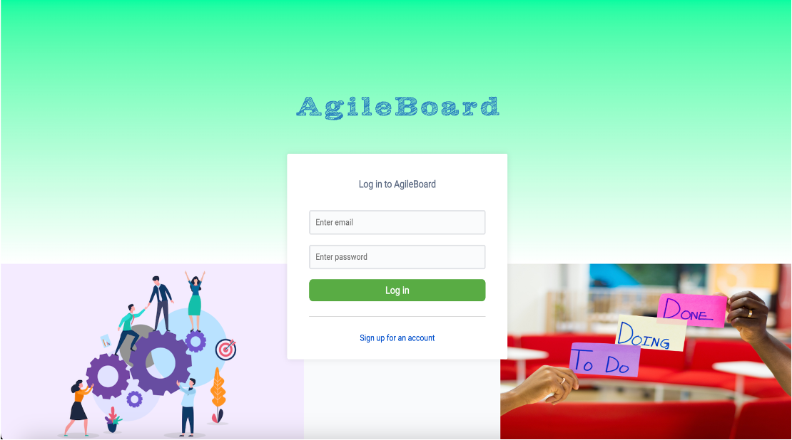
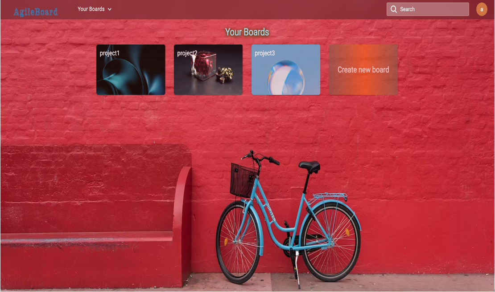
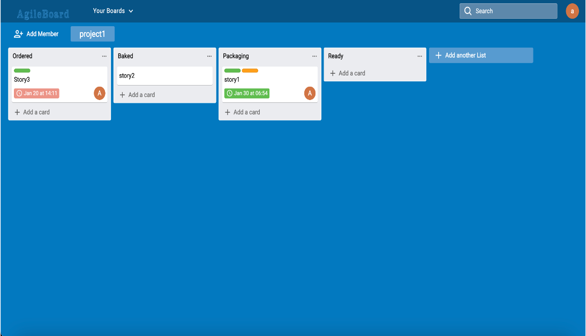

# AgileBoard: A MERN Stack Project

Dive into the capabilities of the MERN stack with AgileBoard, an intricately designed project that simulates the comprehensive functionality of a collaborative task management platform.





## Purpose

AgileBoard is designed to showcase a robust set of frontend and backend capabilities, marking my first foray into leveraging the full power of the MERN stack. This project aims to demonstrate what can be achieved with this modern web development stack.

## Key Features

- **Adaptive Design**: Mimics a user-friendly, responsive interface.
- **Authentication System**: Implements user registration and login functionalities.
- **Board Operations**: Users can create multiple boards, choose backgrounds, and add members.
- **List and Card Creation**: Facilitates the creation of numerous lists and cards within boards.
- **Interactive Drag and Drop**: Enhances the user experience by allowing easy rearrangement of lists and cards.
- **Customization Options**: Board titles and backgrounds can be altered for personalization.
- **Comprehensive Card Details**: Supports adding descriptions, cover colors, members, labels, due dates, checklists, and attachments to cards.
- **Content Management**: Provides the ability to delete boards, lists, and cards.
- **Activity Logs**: Maintains a detailed record of all actions performed on cards and boards.
- **Commenting Feature**: Users can leave comments on cards and boards.
- **Efficient Search**: Allows for quick searching of board or card titles.

## Technologies Employed

### Server Side

- Express.js
- Express-unless
- Mongoose
- CORS
- Path
- Dotenv
- JSON Web Token (JWT)
- Bcrypt.js

### Client Side

- Styled-components
- Redux Toolkit
- React Beautiful DND
- Material-UI
- Axios
- Date-fns
- Moment
- Atlaskit/css-reset
- React-hook/mouse-position
- React Router
- React Hooks

### Development Tools

- Nodemon

## Setup and Installation

### Pre-requisites

- **Node.js**: Download from [Node.js official site](https://nodejs.org/en/download/).
- **MongoDB**: Set up a local MongoDB instance or utilize MongoDB Atlas. Details at [MongoDB's website](https://www.mongodb.com/).

### Installation Guide

1. **Clone the Repository**

   ```sh
   git clone https://github.com/aniketghumed23/AgileBoard.git
   ```

2. **Project Setup**

   - Enter the project directory:
     ```sh
     cd AgileBoard
     ```

3. **Server Setup**

   - Install server dependencies in the server directory:
     ```sh
     cd server
     npm install
     ```
   - Start MongoDB (Example for MongoDB Community Edition):
     ```sh
     brew services start mongodb-community@6.0
     ```
   - Set up environment variables by creating a `.env` file in the server directory, following the provided `.env.example`.

   - Launch the server:
     ```sh
     npm run start
     ```

4. **Client Setup**
   - In a new terminal, navigate to the client directory and install client dependencies:
     ```sh
     cd ../client
     npm install
     ```
   - Run the client application:
     ```sh
     npm run start
     ```

Explore AgileBoard and experience a sophisticated platform designed for task management and collaboration, showcasing the seamless integration of the MERN stack.

